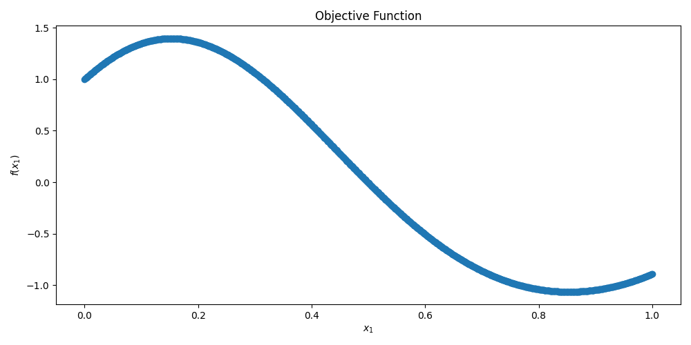

# bayesian_optimization_python
Repository for demoing the effect of various surrogate models on Bayesian Optimization accuracy. 

The class format is based off of the [adaptive timestep PSO optimizer](https://github.com/jonathan46000/pso_python) by [jonathan46000](https://github.com/jonathan46000) for data collection baseline. This repo does not feature any PSO optimization. Instead, the format has been used to retain modularity with other optimizers.

The surrogate models are designed to interface with the optimizers in the AntennaCAT suite, but have not been exhaustively tested as of June. 2024 while they are in parallel development. See [References](#references) for the running list of references as optimizers and surrogate models are added/edited, and features are updated.

Now featuring AntennaCAT hooks for GUI integration and user input handling.

## Table of Contents
* [Bayesian Search](#bayesian-search)
* [Surrogate Models](#surrogate-models)
    * [Radial Basis Function Network](#radial-basis-function-network)
    * [Gaussian Process](#gaussian-process)
    * [Kriging](#kriging)
    * [Polynomial Regression](#polynomial-regression)
    * [Polynomial Chaos Expansion](#polynomial-chaos-expansion)
    * [K-Nearest Neighbors Regression](#k-nearest-neighbors-regression)
    * [Decision Tree Regression](#decision-tree-regression)
    * [Lagrangian Linear Regression](#lagrangian-linear-regression)
    * [Lagrangian Polynomial Regression](#lagrangian-polynomial-regression)
    * [Matern Process](#matern-process)
* [Requirements](#requirements)
* [Implementation](#implementation)
    * [Initialization](#initialization) 
    * [State Machine-based Structure](#state-machine-based-structure)
    * [Constraint Handling](#constraint-handling)
    * [Multi-Objective Optimization](#multi-objective-optimization)
    * [Objective Function Handling](#objective-function-handling)
      * [Creating a Custom Objective Function](#creating-a-custom-objective-function)
      * [Internal Objective Function Example](internal-objective-function-example)
* [Example Implementations](#example-implementations)
    * [Basic Example](#basic-example)
    * [Realtime Graph](#realtime-graph)
* [References](#references)
* [Related Publications and Repositories](#related-publications-and-repositories)
* [Licensing](#licensing)   

## Bayesian Search

Bayesian search, or Bayesian optimization, uses probabilistic models to efficiently optimize functions that are computationally expensive or resource intensive to evaluate. It iteratively updates a Bayesian model of the objective function based on sampled evaluations (of the objective function). 

## Surrogate Models
A surrogate model in optimization serves as a proxy for the actual objective function, which may be costly or impractical to evaluate directly. It approximates the behavior of the objective function using a simpler, computationally efficient model, such as the Gaussian Process (GP) model included in this repository. This surrogate model is iteratively updated based on evaluations of the actual objective function, improving its accuracy over time. It allows optimization algorithms to make informed decisions about where to explore next in the search space, balancing between exploiting known good regions and exploring potentially better ones. Surrogate models are fundamental in speeding up optimization processes by reducing the number of expensive evaluations needed to find optimal solutions.

For comparison and experimental purproses, there is a small library of surrogate models included in this repository that can be used with the included Bayesian optimizer. They are:


### Radial Basis Function Network
A Radial Basis Function Network (RBFN) is a type of artificial neural network that uses radial basis functions as activation functions. It consists of three layers: an input layer, a hidden layer with a non-linear RBF activation function (typically Gaussian), and a linear output layer. The simple approach in this repo uses numpy and basic matrix math rather than a ML specific library. RBFNs are commonly used for function approximation, time-series prediction, and classification tasks. They are valued for their simplicity, ease of training, and ability to model complex, non-linear relationships with a smaller number of neurons compared to other neural network architectures (which means a smaller matrix).


### Gaussian Process

A Gaussian process (GP) is a probabilistic model used primarily in machine learning and optimization. It defines a distribution over functions, where each point in the function's domain is assigned a Gaussian distribution. GPs are characterized by their mean function (typically assumed to be zero) and covariance function (kernel), which determines the relationships between different points. GPs are flexible and powerful tools for regression and uncertainty quantification, allowing predictions not only of the function values but also of the uncertainty associated with those predictions. 


### Kriging

Kriging, like Gaussian processes, is a technique used for interpolation and approximation of data points. Kriging models the spatial correlation between data points to predict values at unsampled locations. It uses a linear combination of data points with weights determined by spatial covariance functions (kriging models) to estimate values and quantify prediction uncertainty. Kriging is advantageous in fields like spatial statistics, where it provides accurate predictions and uncertainty estimates based on known data points' spatial relationships. 

Kriging is a specialized form of Gaussian process regression tailored for spatial datasets, emphasizing the spatial autocorrelation structure to improve prediction accuracy in geospatial applications and beyond.


### Polynomial Regression

Polynomial regression is a form of regression analysis where the relationship between the independent variable x and the dependent variable y is modeled as an n-th degree polynomial function. Unlike linear regression, which assumes a linear relationship, polynomial regression can capture non-linear relationships between variables. 


### Polynomial Chaos Expansion

Polynomial Chaos Expansion (PCE) is a method used in uncertainty quantification and sensitivity analysis. It expresses a stochastic model's output as a series expansion in terms of orthogonal polynomials, typically Hermite, Legendre, or other families depending on the underlying probability distribution. Each polynomial corresponds to a different order of the stochastic variables, capturing the variability and uncertainty in the model's parameters or inputs. PCE provides a way to efficiently compute statistical moments, such as mean and variance, and quantify how uncertainties in input parameters propagate through the model to affect output variability


### K-Nearest Neighbors Regression

As part of a Bayesian optimizer, the K-Nearest Neighbors (KNN) model predicts the objective function's value at a new point based on the values of its k nearest neighbors in the training data. By using the distances and weights of these neighbors, it estimates the function value, guiding the optimizer to explore promising regions of the search space. KNN is valued for its simplicity and non-parametric nature, making it flexible for various optimization problems. However, it may struggle with high-dimensional data. It does not do well on the Himmelblau function as the parameters are currently set.

### Decision Tree Regression

Decision Tree Regression is a predictive modeling technique used for continuous target variables. It works by recursively splitting the data into subsets based on the feature that minimizes the mean squared error (MSE) at each split. Each internal node represents a feature, and each leaf node represents a predicted value, usually the mean of the target values in that region. This method captures non-linear relationships and is easy to interpret. However, it can overfit the training data, so techniques like pruning or using ensemble methods (e.g., Random Forests) are often employed to enhance its performance and generalization ability.


### Lagrangian Linear Regression
Lagrangian Linear Regression is a technique that uses Lagrange multipliers to enforce constraints on the linear regression model, typically for regularization purposes. It adds a penalty term to the cost function to control model complexity and prevent overfitting. The Lagrange multipliers are used to optimize the trade-off between fitting the data and adhering to the regularization constraint. 

### Lagrangian Polynomial Regression
Lagrangian Polynomial Regression is a method that uses Lagrange multipliers to fit a polynomial model to data while imposing constraints on the model's complexity or behavior. Lagrange multipliers help to minimize the error between the data points and the polynomial while ensuring that the polynomial satisfies any specified conditions or regularization constraints (this implemenation does not use explicit constraints for the surrogate model right now).

### Matern Process
A Matern process is a type of covariance function used in Gaussian process regression and Bayesian optimization to model spatial or temporal correlations between data points. It offers flexibility in representing the smoothness of the underlying function by adjusting a parameter that controls the roughness, making it suitable for irregular or non-smooth optimization problems. The current implementation is rough and will likely be updated in the future.

## Requirements

This project requires numpy, pandas, and matplotlib for the full demos. To run the optimizer without visualization, only numpy and pandas are requirements

Use 'pip install -r requirements.txt' to install the following dependencies:

```python
contourpy==1.2.1
cycler==0.12.1
fonttools==4.51.0
importlib_resources==6.4.0
kiwisolver==1.4.5
matplotlib==3.8.4
numpy==1.26.4
packaging==24.0
pandas==2.2.3
pillow==10.3.0
pyparsing==3.1.2
python-dateutil==2.9.0.post0
pytz==2025.1
six==1.16.0
tzdata==2025.1
zipp==3.18.1

```

Optionally, requirements can be installed manually with:

```python
pip install  matplotlib, numpy, pandas

```
This is an example for if you've had a difficult time with the requirements.txt file. Sometimes libraries are packaged together.

## Implementation

### Initialization 

```python
    # Constant variables
    NO_OF_PARTICLES = 11         # Number of particles in swarm
    TOL = 10 ** -18              # Convergence Tolerance
    MAXIT = 10000                # Maximum allowed iterations
    BOUNDARY = 1                 # int boundary 1 = random,      2 = reflecting
                                 #              3 = absorbing,   4 = invisible

    # Objective function dependent variables
    func_F = func_configs.OBJECTIVE_FUNC  # objective function
    constr_F = func_configs.CONSTR_FUNC   # constraint function

    LB = func_configs.LB              # Lower boundaries, [[0.21, 0, 0.1]]
    UB = func_configs.UB              # Upper boundaries, [[1, 1, 0.5]]   
    OUT_VARS = func_configs.OUT_VARS  # Number of output variables (y-values)
    TARGETS = func_configs.TARGETS    # Target values for output

    # optimizer constants
    WEIGHTS = [[0.5, 0.7, 0.78]]       # Update vector weights
    VLIM = 1                           # Initial velocity limit

    best_eval = 1
    parent = None            # for the optimizer test ONLY
    suppress_output = True   # Suppress the console output of particle swarm
    allow_update = True      # Allow objective call to update state 

    # Constant variables
    opt_params = {'NO_OF_PARTICLES': [NO_OF_PARTICLES], # Number of particles in swarm
                'BOUNDARY': [BOUNDARY],                 # int boundary 1 = random,      2 = reflecting
                                                        #   3 = absorbing,   4 = invisible
                'WEIGHTS': [WEIGHTS],                   # Update vector weights
                'VLIM':  [VLIM] }                       # Initial velocity limit

    opt_df = pd.DataFrame(opt_params)
    myOptimizer = swarm(LB, UB, TARGETS, TOL, MAXIT,
                            func_F, constr_F,
                            opt_df,
                            parent=parent)  

    # arguments should take form: 
    # swarm([[float, float, ...]], [[float, float, ...]], [[float, ...]], float, int,
    # func, func,
    # dataFrame,
    # class obj) 
    #  
    # opt_df contains class-specific tuning parameters
    # NO_OF_PARTICLES: int
    # weights: [[float, float, float]]
    # boundary: int. 1 = random, 2 = reflecting, 3 = absorbing,   4 = invisible
    # vlim: float

```

### State Machine-based Structure

This optimizer uses a state machine structure to control the movement of the particles, call to the objective function, and the evaluation of current positions. The state machine implementation preserves the initial algorithm while making it possible to integrate other programs, classes, or functions as the objective function.

A controller with a `while loop` to check the completion status of the optimizer drives the process. Completion status is determined by at least 1) a set MAX number of iterations, and 2) the convergence to a given target using the L2 norm.  Iterations are counted by calls to the objective function. 

Within this `while loop` are three function calls to control the optimizer class:
* **complete**: the `complete function` checks the status of the optimizer and if it has met the convergence or stop conditions.
* **step**: the `step function` takes a boolean variable (suppress_output) as an input to control detailed printout on current particle (or agent) status. This function moves the optimizer one step forward.  
* **call_objective**: the `call_objective function` takes a boolean variable (allow_update) to control if the objective function is able to be called. In most implementations, this value will always be true. However, there may be cases where the controller or a program running the state machine needs to assert control over this function without stopping the loop.

Additionally, **get_convergence_data** can be used to preview the current status of the optimizer, including the current best evaluation and the iterations.

The code below is an example of this process:

```python
    while not myOptimizer.complete():
        # step through optimizer processing
        # this will update particle or agent locations
        myOptimizer.step(suppress_output)
        # call the objective function, control 
        # when it is allowed to update and return 
        # control to optimizer
        myOptimizer.call_objective(allow_update)
        # check the current progress of the optimizer
        # iter: the number of objective function calls
        # eval: current 'best' evaluation of the optimizer
        iter, eval = myOptimizer.get_convergence_data()
        if (eval < best_eval) and (eval != 0):
            best_eval = eval
        
        # optional. if the optimizer is not printing out detailed 
        # reports, preview by checking the iteration and best evaluation

        if suppress_output:
            if iter%100 ==0: #print out every 100th iteration update
                print("Iteration")
                print(iter)
                print("Best Eval")
                print(best_eval)
```

### Constraint Handling
Users must create their own constraint function for their problems, if there are constraints beyond the problem bounds.  This is then passed into the constructor. If the default constraint function is used, it always returns true (which means there are no constraints).

### Boundary Types
This PSO optimizer has 4 different types of bounds, Random (Particles that leave the area respawn), Reflection (Particles that hit the bounds reflect), Absorb (Particles that hit the bounds lose velocity in that direction), Invisible (Out of bound particles are no longer evaluated).

Some updates have not incorporated appropriate handling for all boundary conditions. This bug is known and is being worked on. The most consistent boundary type at the moment is Random. If constraints are violated, but bounds are not, currently random bound rules are used to deal with this problem. 

### Multi-Object Optimization
The no preference method of multi-objective optimization, but a Pareto Front is not calculated. Instead, the best choice (smallest norm of output vectors) is listed as the output.

### Objective Function Handling
The optimizer minimizes the absolute value of the difference of the target outputs and the evaluated outputs. Future versions may include options for function minimization when target values are absent. 

#### Creating a Custom Objective Function

Custom objective functions can be used by creating a directory with the following files:
* configs_F.py
* constr_F.py
* func_F.py

`configs_F.py` contains lower bounds, upper bounds, the number of input variables, the number of output variables, the target values, and a global minimum if known. This file is used primarily for unit testing and evaluation of accuracy. If these values are not known, or are dynamic, then they can be included experimentally in the controller that runs the optimizer's state machine. 

`constr_F.py` contains a function called `constr_F` that takes in an array, `X`, of particle positions to determine if the particle or agent is in a valid or invalid location. 

`func_F.py` contains the objective function, `func_F`, which takes two inputs. The first input, `X`, is the array of particle or agent positions. The second input, `NO_OF_OUTS`, is the integer number of output variables, which is used to set the array size. In included objective functions, the default value is hardcoded to work with the specific objective function.

Below are examples of the format for these files.

`configs_F.py`:
```python
OBJECTIVE_FUNC = func_F
CONSTR_FUNC = constr_F
OBJECTIVE_FUNC_NAME = "one_dim_x_test.func_F" #format: FUNCTION NAME.FUNCTION
CONSTR_FUNC_NAME = "one_dim_x_test.constr_F" #format: FUNCTION NAME.FUNCTION

# problem dependent variables
LB = [[0]]             # Lower boundaries
UB = [[1]]             # Upper boundaries
IN_VARS = 1            # Number of input variables (x-values)
OUT_VARS = 1           # Number of output variables (y-values) 
TARGETS = [0]          # Target values for output
GLOBAL_MIN = []        # Global minima sample, if they exist. 

```

`constr_F.py`, with no constraints:
```python
def constr_F(x):
    F = True
    return F
```

`constr_F.py`, with constraints:
```python
def constr_F(X):
    F = True
    # objective function/problem constraints
    if (X[2] > X[0]/2) or (X[2] < 0.1):
        F = False
    return F
```

`func_F.py`:
```python
import numpy as np
import time

def func_F(X, NO_OF_OUTS=1):
    F = np.zeros((NO_OF_OUTS))
    noErrors = True
    try:
        x = X[0]
        F = np.sin(5 * x**3) + np.cos(5 * x) * (1 - np.tanh(x ** 2))
    except Exception as e:
        print(e)
        noErrors = False

    return [F], noErrors
```


#### Internal Objective Function Example

There are three functions included in the repository:
1) Himmelblau's function, which takes 2 inputs and has 1 output
2) A multi-objective function with 3 inputs and 2 outputs (see lundquist_3_var)
3) A single-objective function with 1 input and 1 output (see one_dim_x_test)

Each function has four files in a directory:
   1) configs_F.py - contains imports for the objective function and constraints, CONSTANT assignments for functions and labeling, boundary ranges, the number of input variables, the number of output values, and the target values for the output
   2) constr_F.py - contains a function with the problem constraints, both for the function and for error handling in the case of under/overflow. 
   3) func_F.py - contains a function with the objective function.
   4) graph.py - contains a script to graph the function for visualization.

Other multi-objective functions can be applied to this project by following the same format (and several have been collected into a compatible library, and will be released in a separate repo)

<p align="center">
        
</p>
   <p align="center">Plotted Himmelblau’s Function with 3D Plot on the Left, and a 2D Contour on the Right</p>

```math
f(x, y) = (x^2 + y - 11)^2 + (x + y^2 - 7)^2
```

| Global Minima | Boundary | Constraints |
|----------|----------|----------|
| f(3, 2) = 0                 | $-5 \leq x,y \leq 5$  |   | 
| f(-2.805118, 3.121212) = 0  | $-5 \leq x,y \leq 5$  |   | 
| f(-3.779310, -3.283186) = 0 | $-5 \leq x,y \leq 5$  |   | 
| f(3.584428, -1.848126) = 0  | $-5 \leq x,y \leq 5$   |   | 

<p align="center">
        
</p>
   <p align="center">Plotted Multi-Objective Function Feasible Decision Space and Objective Space with Pareto Front</p>

```math
\text{minimize}: 
\begin{cases}
f_{1}(\mathbf{x}) = (x_1-0.5)^2 + (x_2-0.1)^2 \\
f_{2}(\mathbf{x}) = (x_3-0.2)^4
\end{cases}
```

| Num. Input Variables| Boundary | Constraints |
|----------|----------|----------|
| 3      | $0.21\leq x_1\leq 1$ <br> $0\leq x_2\leq 1$ <br> $0.1 \leq x_3\leq 0.5$  | $x_3\gt \frac{x_1}{2}$ or $x_3\lt 0.1$| 

<p align="center">
        
</p>
   <p align="center">Plotted Single Input, Single-objective Function Feasible Decision Space and Objective Space with Pareto Front</p>

```math
f(\mathbf{x}) = sin(5 * x^3) + cos(5 * x) * (1 - tanh(x^2))
```
| Num. Input Variables| Boundary | Constraints |
|----------|----------|----------|
| 1      | $0\leq x\leq 1$  | $0\leq x\leq 1$| |

Local minima at $(0.444453, -0.0630916)$

Global minima at $(0.974857, -0.954872)$

## Example Implementations

### Basic PSO Example
`main_test.py` provides a sample use case of the optimizer. 

### Detailed Messages
`main_test_details.py` provides an example using a parent class, and the self.suppress_output flag to control error messages that are passed back to the parent class to be printed with a timestamp. This implementation sets up the hooks for integration with AntennaCAT in order to provide the user feedback of warnings and errors.

### Realtime Graph

<p align="center">
        
</p>

`main_test_graph.py` provides an example using a parent class, and the self.suppress_output flag to control error messages that are passed back to the parent class to be printed with a timestamp. Additionally, a realtime graph shows particle locations at every step.

NOTE: if you close the graph as the code is running, the code will continue to run, but the graph will not re-open.

## References


[1] Wikipedia Contributors, “Himmelblau’s function,” Wikipedia, Dec. 29, 2023. https://en.wikipedia.org/wiki/Himmelblau%27s_function 

[2] Wikipedia Contributors, “Bayesian optimization,” Wikipedia, Jul. 05, 2019. https://en.wikipedia.org/wiki/Bayesian_optimization

[3] W. Wang, “Bayesian Optimization Concept Explained in Layman Terms,” Medium, Mar. 22, 2022. https://towardsdatascience.com/bayesian-optimization-concept-explained-in-layman-terms-1d2bcdeaf12f

[4] C. Brecque, “The intuitions behind Bayesian Optimization with Gaussian Processes,” Medium, Apr. 02, 2021. https://towardsdatascience.com/the-intuitions-behind-bayesian-optimization-with-gaussian-processes-7e00fcc898a0

[5] “Introduction to Bayesian Optimization (BO) — limbo 0.1 documentation,” resibots.eu. https://resibots.eu/limbo/guides/bo.html 

[6] “Radial Basis Function Networks (RBFNs) with Python 3: A Comprehensive Guide – Innovate Yourself,” Nov. 03, 2023. https://innovationyourself.com/radial-basis-function-networks-rbfn/ 

[7] Everton Gomede, PhD, “Radial Basis Functions Neural Networks: Unlocking the Power of Nonlinearity,” Medium, Jun. 06, 2023. https://medium.com/@evertongomede/radial-basis-functions-neural-networks-unlocking-the-power-of-nonlinearity-c67f6240a5bb

[8] J. Luo, W. Xu and J. Chen, "A Novel Radial Basis Function (RBF) Network for Bayesian Optimization," 2021 IEEE 7th International Conference on Cloud Computing and Intelligent Systems (CCIS), Xi'an, China, 2021, pp. 250-254, doi: 10.1109/CCIS53392.2021.9754629.

[9] Wikipedia Contributors, “Kriging,” Wikipedia, Oct. 16, 2018. https://en.wikipedia.org/wiki/Kriging


[10] “Polynomial kernel,” Wikipedia, Oct. 02, 2019. https://en.wikipedia.org/wiki/Polynomial_kernel

[11] A. Radhakrishnan, M. Luyten, G. Stefanakis, and C. Cai, “Lecture 3: Kernel Regression,” 2022. Available: https://web.mit.edu/modernml/course/lectures/MLClassLecture3.pdf

[12] “Polynomial chaos,” Wikipedia, Mar. 19, 2024. https://en.wikipedia.org/wiki/Polynomial_chaos 

[13] “Polynomial Chaos Expansion — Uncertainty Quantification,” dictionary.helmholtz-uq.de. https://dictionary.helmholtz-uq.de/content/PCE.html (accessed Jun. 28, 2024).

[14] T. Srivastava, “Introduction to KNN, K-Nearest Neighbors : Simplified,” Analytics Vidhya, Mar. 07, 2019. https://www.analyticsvidhya.com/blog/2018/03/introduction-k-neighbours-algorithm-clustering/

[15] Wikipedia Contributors, “k-nearest neighbors algorithm,” Wikipedia, Mar. 19, 2019. https://en.wikipedia.org/wiki/K-nearest_neighbors_algorithm
 
[16] “Python | Decision Tree Regression using sklearn,” GeeksforGeeks, Oct. 04, 2018. https://www.geeksforgeeks.org/python-decision-tree-regression-using-sklearn/

[17] “Decision Tree Regression,” Saedsayad.com, 2019. https://www.saedsayad.com/decision_tree_reg.htm

[18] Wikipedia Contributors, “Decision tree learning,” Wikipedia, Jun. 12, 2019. https://en.wikipedia.org/wiki/Decision_tree_learning


## Related Publications and Repositories
This software works as a stand-alone implementation, and as one of the optimizers integrated into AntennaCAT.

## Licensing

The code in this repository has been released under GPL-2.0
